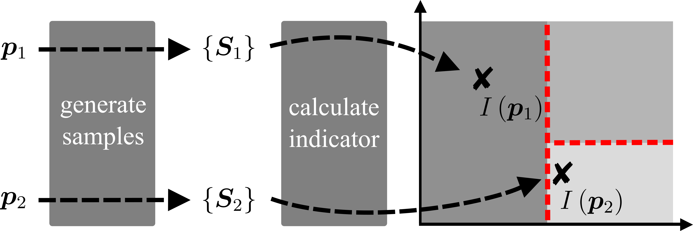

# Interpretable-and-unsupervised-phase-classification

---

## Abstract

Fully automated classification methods that yield direct physical insights into phase diagrams are of current interest. Here, we demonstrate an unsupervised machine learning method for phase classification which is rendered interpretable via an analytical derivation of its optimal predictions and allows for an automated construction scheme for order parameters.
Based on these findings, we propose and apply an alternate, physically-motivated, data-driven scheme which relies on the difference between mean input features. This mean-based method is computationally cheap and directly interpretable. As an example, we consider the physically rich ground-state phase diagram of the spinless Falicov-Kimball model.



## This repository

This repository contains a working example for the prediction-based and mean-based method discussed in the [paper](link). We provide configuration samples and the corresponding values of correlation functions for the spinless FKM on a L=20 square lattice in the noise-free case. The code features:
- the prediction-based method with deep neural networks (DNNs)
- the prediction-based method with linear models
- the mean-based method
    
As an input, one can choose between raw configurations, the magnitude of their discrete Fourier transform, or the corresponding values of the set of three correlation functions. Furthermore, one can analyze the noise-free case in a one- or two-dimensional parameter space.

**Requirements**

We have tested our code with Python 3.8.2 and PyTorch 1.5.0. To run the code, please install PyTorch, Numpy, Scipy, and Matplotlib.

**Data**

The data will be provided upon request. It contains the raw configurations, as well as the corresponding values of correlation functions for the spinless FKM on a L=20 square lattice in the noise-free and noisy case. In the noise-free case, a single set of inputs corresponding to the estimated ground-state configuration is provided. Whereas in the noisy case, we provide set of inputs corresponding to the 10 configuration with the lowest-lying energies. This data should be put into the dedicated *data* folder.

**Prediction-based method with DNNs**

The folder *prediction_based_method/DNNs* contains the code for the prediction-based method with DNNs. First, configure the *conf.py* file to, e.g., select the input and specify DNN hyperparameters. Then, run the *main.py* file which will create a folder *results/model* for the model and start the training of the DNN.
To evaluate the DNN during (or after) training, specify the corresponding training epoch in the *model/code/plotting.py* file and executing it. This will generate plots of the predicted phase diagram and loss curve in the *model/final_figures* folder.

**Prediction-based method with linear models**

The folder *prediction_based_method/linear_models* contains the code for the prediction-based method with linear models. Again, configure corresponding *conf.py* file and run the *main.py* file. This will generate a plot of the vector-field divergence and predictions along the selected linescan within the same folder.

**Mean-based method**

The folder *mean_based_method* contains the code for the mean-based method. Configure the corresponding *conf.py* file and run the *main.py* file. This will generate a plot of the inferred phase diagram within the same folder.

## Authors

- [Julian Arnold](https://github.com/arnoldjulian)
- [Frank Schäfer](https://github.com/frankschae)
- [Martin Žonda](http://cmd.karlov.mff.cuni.cz/~zonda/index.html)
- [Axel U.J. Lode](http://ultracold.org/menu/index.php?option=com_content&view=article&id=14&Itemid=107)

If you encounter any problems, please don't hesitate to file an issue or contact us directly. 
In case you found this work useful, please cite our [paper](link):

```
@article{arnold:2020,
  title={Interpretable and unsupervised phase classification},
  author={Arnold, Julian and Sch\"{a}fer, Frank and {\v{Z}}onda, Martin and Lode, Axel U. J.},
  journal={arXiv preprint xx},
  year={2020}
}
